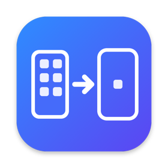

  

<h1 align="center">AppRelay — перенос приложений на новый iPhone</h1>

  Даже тех, которых больше нет в App Store: банки, удалённые и «недоступные в вашем регионе» приложения.

  <a href="https://apprelay-license.apprelay-license.workers.dev/download"><b>⬇️ Скачать для Mac</b></a> ·
  <a href="https://apprelay-license.apprelay-license.workers.dev/download/windows"><b>⬇️ Скачать для Windows</b></a> ·
  <a href="https://apprelay.pages.dev">Сайт</a> ·
  <a href="https://t.me/AppRelayPayBot">Поддержка в Telegram</a>

---

AppRelay — программа для Mac и Windows. Она смотрит, какие приложения и версии стоят на вашем старом iPhone, скачивает эти версии с серверов Apple на ваш Apple ID и устанавливает на новый iPhone. Так можно перенести СберБанк Онлайн, Т-Банк, Альфа-Банк, ВТБ и другие приложения, которые удалены из App Store.

### Как перенести приложения

1. Скачайте AppRelay: для Mac — **AppRelay.dmg** (перетащите AppRelay в «Программы»), для Windows — **AppRelay-Setup.exe**.
2. Подключите оба iPhone к компьютеру кабелем, разблокируйте и нажмите «Доверять».
3. Отметьте приложения и нажмите «Перенести».
4. Войдите в Apple ID, с которого приложения скачивались.

**Первый запуск на Mac:** macOS попросит подтвердить запуск. Откройте AppRelay → «Готово» → Системные настройки → Конфиденциальность и безопасность → «Всё равно открыть». Это нужно один раз.

**Первый запуск на Windows:** если Windows пишет «защитила ваш компьютер» — «Подробнее» → «Выполнить в любом случае». AppRelay сам предложит поставить бесплатное приложение Apple Devices — оно нужно Windows, чтобы видеть iPhone.

Дальше обновления приходят сами — AppRelay предложит «Обновить» при запуске.

### Условия

- Mac на macOS 14 или новее (Apple Silicon и Intel) или компьютер с Windows 10 или 11, кабели для обоих iPhone.
- Приложение должно стоять на старом iPhone и быть скачано на ваш Apple ID.
- Переносятся сами приложения; данные внутри них — нет (войдите в аккаунты заново).
- Пароль Apple ID передаётся только Apple и нигде не сохраняется.

### Цена

Первый перенос на каждый iPhone — бесплатно. Дальше полный доступ — 200 ₽ за iPhone навсегда (+ комиссия платёжной системы), без подписки. Покупка привязана к iPhone и действует и на Mac, и на Windows. [Тарифы](https://apprelay.pages.dev/buy)

### Инструкции

- [Как перенести банковские приложения на новый iPhone](https://apprelay.pages.dev/bank-apps)
- [Как перенести приложения, удалённые из App Store](https://apprelay.pages.dev/deleted-apps)

Вопросы — [@AppRelayPayBot](https://t.me/AppRelayPayBot).
